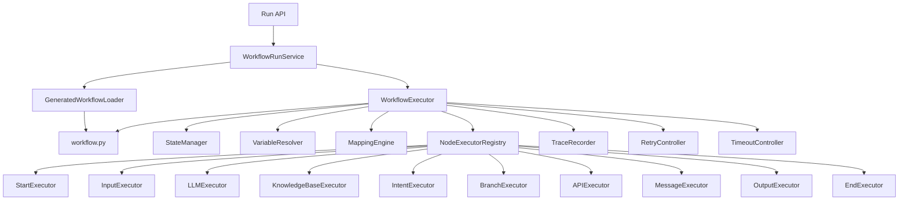
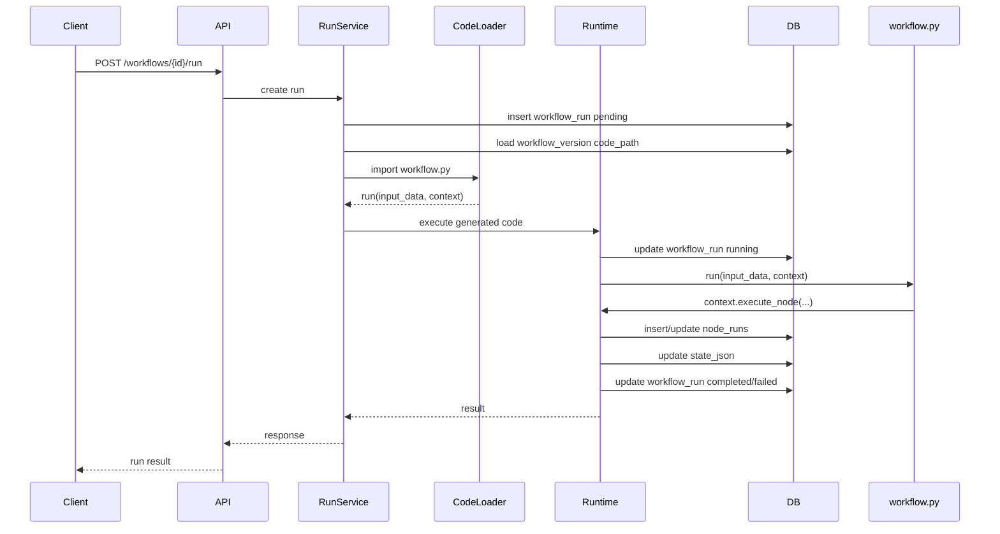

# Agent 工作流平台 Runtime 详细设计文档 v0.1

## 1. 文档目标

本文档定义 Agent 工作流平台 MVP 阶段 Workflow Runtime 的详细设计，包括运行时架构、执行流程、State 管理、变量解析、节点执行生命周期、分支解析、重试超时、Trace 记录、错误处理和各类 MVP 节点执行器职责。

Runtime 的目标是：

```text
加载已发布工作流版本
加载该版本对应的本地 generated workflow code
初始化运行 State
import workflow.py 并调用固定 run 入口
解析变量和输入输出映射
调用对应 NodeExecutor
处理分支、错误、重试和超时
记录完整 Trace
输出最终结果
```

---

## 2. MVP Runtime 边界

MVP 支持：

```text
单 Start Node
至少一个 End Node
有向无环图
顺序执行
条件分支
变量引用
节点输入输出映射
节点重试
节点超时
失败终止工作流
运行 Trace
同步运行和异步运行
发布版本生成本地 workflow.py
运行以本地 generated workflow code 为准
```

MVP 暂不支持：

```text
循环
并行
暂停恢复
人工审批
长时间等待回调
分布式恢复
补偿事务
调度运行
代码沙箱
```

说明：MVP 的 generated workflow code 运行在本地可信开发环境中，不提供多租户代码沙箱。生成代码是可编辑源码，适合本地调试和二次开发。

---

## 3. Runtime 总体架构



---

## 4. 核心组件职责

## 4.1 WorkflowRunService

负责运行入口：

```text
接收运行请求
选择 workflow_version
创建 workflow_run
选择同步或异步执行
返回 run_id 或最终结果
```

---

## 4.2 GraphLoader

在本地代码生成模式下，GraphLoader 不在运行主路径中解释执行图。它只用于发布校验、代码生成和问题排查时读取发布快照：

```text
根据 version_id 加载 workflow_versions.graph_json
graph_json 是生成 workflow.py 的输入和审计快照
运行主路径使用 workflow_versions.code_path，不重新解释 graph_json
```

---

### 4.2.1 GeneratedWorkflowLoader

负责加载已发布版本对应的本地代码：

```text
读取 workflow_versions.code_path
确认 workflow.py 存在
重新计算本地 code_hash
import workflow.py
按 code_path + code_hash 使用唯一 module name，避免 Python import 缓存导致手改代码不生效
确认存在 async def run(input_data, context) -> dict
返回可执行 run 入口和 code metadata
```

错误码：

```text
workflow_code_missing
workflow_code_import_failed
workflow_entrypoint_missing
```

如果本地代码 hash 与 workflow_versions.code_hash 不一致，不阻止运行；Runtime 需要在 workflow_runs.metadata_json 记录 code_modified=true。

---

## 4.3 GraphValidator

负责发布前和代码生成前强校验；运行阶段只做 code_path、文件 hash、import 和入口校验：

```text
schema_version 合法
节点类型合法
节点 ID 唯一
边 ID 唯一
必须有且只有一个 Start Node
必须至少有一个 End Node
Start Node 不能有入边
End Node 不能有出边
所有 edge.source / edge.target 必须存在
所有业务节点必须可从 Start Node 到达
MVP 不支持环，检测到环应发布失败或代码生成失败
Branch Node 的 target 必须存在
Branch Node 的每个 target 必须同时存在对应出边，便于前端展示和 Trace
Branch Node 的所有出边必须能映射回某个 branches[].target
发布图中不允许 enabled: false，发现时报 disabled_node_in_publish
```

---

## 4.4 WorkflowExecutor

Runtime 核心执行器：

```text
初始化 State
调用 generated workflow code 的 run(input_data, context)
创建 node_run
调用 NodeExecutor
写回 State
更新 workflow_run 状态
```

在代码生成模式下，节点顺序和节点调用逻辑已经写入 workflow.py。WorkflowExecutor 主要负责运行上下文、Trace、错误边界和状态持久化；具体节点编排以本地 workflow.py 为准。

生成代码不能直接写数据库。`workflow.py` 只能通过 RuntimeContext 暴露的受控方法调用节点、更新 State 和记录 Trace，避免绕过脱敏、重试、超时和错误边界。

---

## 4.5 StateManager

负责 State 的读写和持久化：

```text
创建初始 State
读取路径值
写入路径值
合并节点输出
每个节点成功后保存 state_json
最终写入 output_json
```

---

## 4.6 VariableResolver

负责解析 Mustache 变量：

```text
先解析 input_mapping，得到 node_input
再解析 config 内需要运行时替换的字段
解析 Output Node 的 outputs
解析 Message Node 的 template
解析 API Node 的 headers / body / query_params
解析 secrets 引用
```

config 解析上下文 = node_input + State。未带根路径的 `{{question}}` 优先从 node_input 读取；`{{variables.xxx}}`、`{{input.xxx}}` 等显式根路径从 State 读取；`{{secrets.xxx}}` 只允许在服务端 config 解析阶段使用。

可引用域：

```text
input
variables
messages
outputs
metadata
secrets
```

说明：

```text
secrets 是服务端专用解析域
前端只能看到 secret_key，不能看到真实值
Trace 中不得记录 secret 真实值
```

---

## 4.7 MappingEngine

负责输入输出映射：

```text
input_mapping → node_input
node_output + output_mapping → state
```

---

## 4.8 NodeExecutorRegistry

根据 node.type 获取对应执行器：

```text
start             StartNodeExecutor
input             InputNodeExecutor
llm               LLMNodeExecutor
knowledge_base    KnowledgeBaseNodeExecutor
intent            IntentNodeExecutor
branch            BranchNodeExecutor
api               APINodeExecutor
message           MessageNodeExecutor
output            OutputNodeExecutor
end               EndNodeExecutor
```

---

## 4.9 TraceRecorder

负责写入：

```text
workflow_runs
node_runs
错误信息
耗时
token usage
API 调用元数据
知识库检索元数据
```

---

## 4.10 NextNodeResolver

负责描述图模式下的下一节点解析规则。在本地代码生成模式下，该逻辑应在发布时代码生成阶段写入 `workflow.py`，运行时不再读取 `graph_json` 解析下一节点：

```text
普通节点：根据出边找到下一个节点
Branch Node：根据 selected target 找到下一个节点
End Node：结束工作流
```

---

## 5. Runtime 数据结构

## 5.1 State

MVP State：

```json
{
  "input": {},
  "variables": {},
  "messages": [],
  "outputs": {},
  "metadata": {
    "workflow_id": "",
    "version_id": "",
    "run_id": "",
    "user_id": ""
  }
}
```

约束：

```text
input 运行开始后只读
metadata 运行开始后只读
variables 用于节点间交换数据
messages 用于用户可见消息
outputs 用于最终业务输出
```

---

## 5.2 RuntimeContext

NodeExecutor 执行时接收上下文：

```json
{
  "run_id": 2001,
  "workflow_id": 1,
  "version_id": 10,
  "user_id": 1001,
  "request_id": "req_001",
  "logger": {},
  "secrets": {},
  "services": {}
}
```

`services` 可包含：

```text
llm_client
embedding_client
knowledge_service
http_client
tool_service
trace_recorder
```

Generated workflow code 可使用的受控 Runtime 方法：

```text
context.execute_node(node_id, node_type, node_config, input_mapping=None, output_mapping=None)
context.get_state()
context.set_output(key, value)
context.finish(outputs)
context.fail(error_code, error_message)
```

这些方法内部仍由 Runtime 调用 NodeExecutor、StateManager 和 TraceRecorder；`workflow.py` 不直接访问数据库。

---

## 6. 执行入口

## 6.1 同步运行

适合调试和短流程：

```text
POST /workflows/{id}/run
execution_mode = sync
```

规则：

```text
API 请求等待 Runtime 完成
超过 API 网关超时时间前应返回超时错误
建议只用于编辑器调试
```

---

## 6.2 异步运行

适合正式运行：

```text
POST /workflows/{id}/run
execution_mode = async
```

规则：

```text
API 创建 workflow_run 后返回 run_id
后台任务执行 Runtime
前端轮询 /runs/{run_id} 或 /runs/{run_id}/trace
```

---

## 6.3 Generated Workflow Runtime

发布工作流时，后端根据 `workflow_versions.graph_json` 生成本地 Python 代码。运行时默认加载本地代码，而不是重新解释数据库中的 graph。

目录约定：

```text
backend/generated_workflows/
  workflow_000001/
    v000001/
      __init__.py
      workflow.py
      manifest.json
```

`workflow.py` 固定入口：

```python
async def run(input_data, context) -> dict:
    ...
```

运行规则：

```text
运行时使用 workflow_versions.code_path 指向的 workflow.py
每次发布生成新的版本目录，不覆盖旧版本
本地 workflow.py 可手动编辑，运行以本地文件为准
运行前重新计算 code_hash
code_hash 与发布记录不一致时记录 code_modified=true
hash 不一致不阻止运行
workflow.py 缺失、import 失败或 run 入口缺失才返回运行错误
```

`manifest.json` 建议内容：

```json
{
  "workflow_id": 1,
  "version_id": 10,
  "version": 1,
  "graph_hash": "...",
  "code_hash": "...",
  "generated_at": "2026-05-17T08:30:00Z"
}
```

---

## 7. 运行生命周期



---

## 8. 详细执行流程

```text
1. 接收运行请求
2. 校验用户是否有运行权限
3. 加载 workflow 和 workflow_version
4. 确认 workflow_versions.code_path
5. 重新计算本地 workflow.py code_hash
6. import workflow.py
7. 校验存在 async run(input_data, context)
8. 创建 workflow_run，状态 pending
9. 在 metadata_json 记录 code_path_at_run / code_hash_at_run / code_modified
10. 初始化 RuntimeContext
11. workflow_run 更新为 running
12. 调用 workflow.py 的 run(input_data, context)
13. 生成代码通过 context.execute_node 调用 Runtime
14. Runtime 统一写 node_runs 和 state_json
15. run 返回最终 output
16. 写入 workflow_runs.output_json
17. workflow_run 标记 completed
18. 返回结果
```

失败流程：

```text
1. code_path 缺失或文件不存在，workflow_run failed，error_code=workflow_code_missing
2. import workflow.py 失败，workflow_run failed，error_code=workflow_code_import_failed
3. 缺少 async run 入口，workflow_run failed，error_code=workflow_entrypoint_missing
4. run 执行中捕获 RuntimeError
5. 写 node_run failed
6. 判断 retry 策略
7. 如果可重试，创建下一次 attempt
8. 如果不可重试，应用 on_error
9. MVP 默认 fail_workflow
10. workflow_run 标记 failed
11. 保存 error_code / error_message
```

---

## 9. 变量解析规则

## 9.1 变量引用语法

```text
{{input.user_query}}
{{variables.kb_context}}
{{variables.intent_result.intent}}
{{metadata.user_id}}
{{secrets.order_api_key}}
```

---

## 9.2 完整变量引用

如果整个字段是一个变量引用，则保留原始类型。

输入：

```json
{
  "context": "{{variables.kb_context}}"
}
```

如果 `variables.kb_context` 是数组，解析后仍为数组。

---

## 9.3 嵌入字符串变量

如果变量嵌入字符串，则转为字符串。

输入：

```text
问题：{{input.user_query}}
资料：{{variables.kb_context}}
```

规则：

```text
string / number / boolean 转为字符串
object / array 转为紧凑 JSON 字符串
null 转为空字符串或严格报错，MVP 建议严格报错
```

---

## 9.4 变量不存在

MVP 使用严格模式：

```json
{
  "error_code": "variable_not_found",
  "error_message": "Variable not found: variables.order_id",
  "retryable": false
}
```

---

## 10. input_mapping 处理

执行节点前：

```text
1. 读取 node.input_mapping
2. 递归解析变量引用
3. 得到 node_input
4. 写入 node_runs.input_json
5. 传给 NodeExecutor
```

随后 Runtime 会递归解析 node.config 中的字符串字段。config 解析时可以引用 node_input 的顶层字段，例如 `config.query = "{{question}}"` 引用的是 input_mapping 解析后的 `node_input.question`。

示例：

```json
{
  "input_mapping": {
    "question": "{{input.user_query}}",
    "context": "{{variables.kb_context}}"
  }
}
```

解析后：

```json
{
  "question": "退款规则是什么？",
  "context": [
    {
      "content": "用户可在签收后 7 天内申请退款..."
    }
  ]
}
```

---

## 11. output_mapping 处理

Runtime 统一通过 `apply_node_result` 写 State。

```text
普通节点：根据 node.output_mapping 写入 State
Output Node：忽略 output_mapping，将 node_output.outputs merge 到 state.outputs
```

Output Node 的 merge 由 Runtime 完成，NodeExecutor 仍然不能直接修改 State。

NodeExecutor 返回：

```json
{
  "answer": "可以在 7 天内申请退款",
  "confidence": 0.91
}
```

output_mapping：

```json
{
  "answer": "variables.final_answer",
  "confidence": "variables.answer_confidence"
}
```

写入 State：

```json
{
  "variables": {
    "final_answer": "可以在 7 天内申请退款",
    "answer_confidence": 0.91
  }
}
```

---

## 11.1 写入规则

允许写入：

```text
variables.xxx
outputs.xxx
messages
outputs
```

不允许写入：

```text
input.xxx
metadata.xxx
secrets.xxx
```

特殊规则：

```text
target = messages，表示追加消息到 state.messages
target = outputs，表示将对象 merge 到 state.outputs
target = variables.xxx，表示覆盖该变量路径
target = outputs.xxx，表示覆盖该输出路径
```

如果 `messages` 写入值是数组，则逐条追加；如果是对象，则追加一条。

---

## 12. 节点执行生命周期

```text
1. validate_node_config
2. resolve_input_mapping
3. resolve_node_config
4. create_node_run(status=running, attempt=n)
5. execute_node_with_timeout
6. validate_node_output
7. apply_output_mapping_or_output_merge
8. update_node_run_success
9. persist_state
10. resolve_next_node
```

失败：

```text
1. catch error
2. normalize error
3. update_node_run_failed
4. check retry policy
5. retry or apply on_error
6. update workflow_run failed if needed
```

---

## 13. NodeExecutor 接口

建议接口：

```python
class NodeExecutor:
    def execute(self, node, node_input, state, context):
        pass
```

返回值：

```text
必须是 JSON-serializable object
不能返回二进制对象
不能直接修改 State
```

State 只能由 Runtime 根据 `output_mapping` 写入，避免节点绕过协议。

---

## 14. MVP 节点执行器设计

## 14.1 StartNodeExecutor

职责：

```text
不执行业务逻辑
返回空对象
```

输出：

```json
{}
```

---

## 14.2 InputNodeExecutor

职责：

```text
根据 config.fields 校验 state.input
检查 required 字段
检查基础类型
可通过 output_mapping 把 input 字段复制到 variables
```

建议输出：

```json
{
  "user_query": "我想申请退款"
}
```

说明：

```text
Input Node 不负责向用户提问
MVP 没有暂停恢复能力
多轮信息收集留给 Info Collection Node
```

---

## 14.3 LLMNodeExecutor

职责：

```text
读取 provider / model / prompt / temperature / max_tokens
使用 node_input 解析 system_prompt 和 user_prompt
调用 LLM Provider
返回 answer 和 usage
记录 token usage 到 metadata_json
```

执行步骤：

```text
1. 解析 config.system_prompt
2. 解析 config.user_prompt
3. 构造模型请求
4. 调用模型
5. 提取文本结果
6. 返回 answer / usage
```

输出：

```json
{
  "answer": "模型生成的回答",
  "usage": {
    "prompt_tokens": 1000,
    "completion_tokens": 300,
    "total_tokens": 1300
  }
}
```

---

## 14.4 KnowledgeBaseNodeExecutor

职责：

```text
解析 query
生成 query embedding
按 knowledge_base_ids 检索 chunks
应用 top_k 和 score_threshold
返回内容和来源
```

执行步骤：

```text
1. 使用 node_input 解析 config.query
2. 调用 embedding model 生成 query embedding
3. 在 knowledge_chunks 中执行向量检索
4. 加入 knowledge_base_id / status / 权限过滤
5. 返回 top_k chunks
```

输出：

```json
{
  "chunks": [
    {
      "chunk_id": "chunk_001",
      "content": "相关文档内容",
      "score": 0.86,
      "source": {
        "document_id": 5001,
        "file_name": "售后政策.pdf",
        "page_start": 3,
        "page_end": 3,
        "section_title": "退款规则"
      }
    }
  ]
}
```

---

## 14.5 IntentNodeExecutor

职责：

```text
根据 config.intents 构造分类 prompt
调用轻量 LLM
返回 intent 和 confidence
失败时可使用 fallback_intent
```

输出：

```json
{
  "intent": "refund_request",
  "confidence": 0.92
}
```

MVP 建议要求模型返回 JSON，并做解析校验。

---

## 14.6 BranchNodeExecutor

职责：

```text
按顺序计算 branches
命中第一个条件后返回 target
没有命中时使用 default
没有 default 则失败
```

支持操作符：

```text
eq
neq
contains
gt
gte
lt
lte
exists
not_exists
```

输出：

```json
{
  "selected_branch_id": "branch_refund",
  "target": "llm_refund_1"
}
```

注意：

```text
Branch Node 不执行任意代码表达式
condition.left 可以是变量引用
condition.right 可以是常量或变量引用
target 必须存在于 graph.nodes
target 必须有对应 edge（source=Branch 节点 id，target=target）
Branch 节点的所有出边必须能映射回某个 branches[].target
```

---

## 14.7 APINodeExecutor

职责：

```text
解析 method / url / headers / query_params / body
解析 secrets
发送 HTTP 请求
应用 timeout
限制响应体大小
提取 response_path
返回 response 和 status_code
```

输出：

```json
{
  "response": {
    "status": "paid",
    "amount": 199
  },
  "status_code": 200
}
```

安全规则：

```text
Trace 中 headers 必须脱敏
Authorization 不写入 node_runs.input_json
默认禁止访问内网地址，除非管理员允许
响应体大小需要限制
```

---

## 14.8 MessageNodeExecutor

职责：

```text
解析 template
生成用户可见消息
通过 output_mapping 追加到 state.messages
```

输出：

```json
{
  "message": {
    "type": "text",
    "content": "这里是回复内容"
  }
}
```

---

## 14.9 OutputNodeExecutor

职责：

```text
解析 config.outputs
生成最终 outputs
返回 node_output.outputs
Runtime 将 node_output.outputs merge 到 state.outputs
Output Node 不使用 output_mapping
```

输出：

```json
{
  "outputs": {
    "answer": "最终回答",
    "sources": []
  }
}
```

---

## 14.10 EndNodeExecutor

职责：

```text
不执行业务逻辑
通知 WorkflowExecutor 结束运行
```

输出：

```json
{}
```

---

## 15. 下一节点解析

## 15.1 普通节点

规则：

```text
普通节点在 MVP 中建议只有一条出边
如果没有出边且不是 End Node，则运行失败
如果有多条出边且不是 Branch Node，则发布校验失败
```

---

## 15.2 Branch Node

规则：

```text
Branch Node 的 NodeExecutor 返回 target
Runtime 根据 target 找到下一节点
target 必须存在
target 必须在 Branch 出边列表中
Branch 出边必须与 branches[].target 完全一致
```

---

## 15.3 End Node

规则：

```text
执行到 End Node 后结束
workflow_run.status = completed
workflow_run.output_json = state.outputs
```

---

## 16. 重试策略

节点配置：

```json
{
  "retry": {
    "max_attempts": 3,
    "backoff": "exponential",
    "retry_on": ["timeout", "rate_limit", "network_error"]
  }
}
```

规则：

```text
max_attempts 包含第一次执行
每次 attempt 创建一条 node_runs
只有 retryable=true 且 error_code 在 retry_on 中才重试
超过 max_attempts 后应用 on_error
```

backoff：

```text
none          不等待
fixed         固定等待，例如 1s
exponential   1s, 2s, 4s，上限可配置
```

MVP 可先实现：

```text
max_attempts
none / fixed
```

---

## 17. 超时控制

节点级 timeout：

```json
{
  "timeout": 60
}
```

规则：

```text
每个节点单独计时
超过 timeout 后终止该节点执行
记录 error_code = timeout
根据 retry_on 判断是否重试
```

建议默认值：

```text
LLM Node：60s
Knowledge Base Node：30s
API Node：30s
Intent Node：30s
其他节点：10s
```

---

## 18. 错误处理

统一错误格式：

```json
{
  "error_code": "llm_provider_error",
  "error_message": "LLM provider returned 500",
  "error_detail": {},
  "retryable": true
}
```

常见错误：

```text
variable_not_found
invalid_config
timeout
llm_provider_error
api_request_error
api_response_error
knowledge_base_error
branch_no_match
output_mapping_error
permission_denied
unknown_error
```

MVP on_error：

```text
fail_workflow
```

预留：

```text
skip_node
go_to_node
wait_for_human
```

---

## 19. Trace 记录策略

每个节点执行记录：

```text
node_id
node_type
node_name
status
attempt
input_json
output_json
error_code
error_message
duration_ms
metadata_json
started_at
ended_at
```

敏感信息处理：

```text
secrets 真实值不进入 input_json
Authorization 等敏感 Header 必须脱敏
LLM Prompt 是否完整保存可做系统配置
API 响应体过大时截断
```

LLM metadata：

```json
{
  "model": "gpt-4.1-mini",
  "prompt_tokens": 1000,
  "completion_tokens": 300,
  "total_tokens": 1300,
  "estimated_cost": 0.01
}
```

API metadata：

```json
{
  "method": "POST",
  "url": "https://api.example.com/orders/query",
  "status_code": 200,
  "duration_ms": 420
}
```

Knowledge Base metadata：

```json
{
  "knowledge_base_ids": [101],
  "top_k": 5,
  "returned_chunks": 4
}
```

---

## 20. Runtime 伪代码

```python
class WorkflowExecutor:
    async def run(self, workflow_version, initial_input, context):
        generated = self.generated_loader.load(workflow_version)
        state = self.state_manager.create_initial_state(
            input_json=initial_input,
            metadata={
                "workflow_id": workflow_version.workflow_id,
                "version_id": workflow_version.id,
                "run_id": context.run_id,
                "user_id": context.user_id,
            },
        )

        runtime_context = context.with_runtime_api(
            state=state,
            execute_node=self.execute_node_with_retry,
            state_manager=self.state_manager,
            trace_recorder=self.trace,
        )

        self.trace.mark_run_running(context.run_id)
        output = await generated.run(initial_input, runtime_context)
        state = self.state_manager.merge_outputs(state, output)
        self.state_manager.persist(context.run_id, state)

        self.trace.mark_run_completed(
            run_id=context.run_id,
            output_json=state["outputs"],
            state_json=state,
        )

        return state
```

---

## 21. execute_node_with_retry 伪代码

```python
def execute_node_with_retry(self, node, state, context):
    retry = node.get("retry", {"max_attempts": 1, "backoff": "none"})
    max_attempts = retry.get("max_attempts", 1)

    for attempt in range(1, max_attempts + 1):
        started_at = now()
        node_input = None
        node_run_id = None

        try:
            node_input = self.mapping_engine.resolve_input_mapping(node, state, context)
            resolved_config = self.variable_resolver.resolve_node_config(
                config=node.get("config", {}),
                node_input=node_input,
                state=state,
                context=context,
            )
            node_run_id = self.trace.create_node_run(
                run_id=context.run_id,
                node=node,
                attempt=attempt,
                input_json=self.redactor.redact(node_input),
            )

            executor = self.registry.get(node["type"])
            node_output = self.timeout_controller.run(
                timeout_seconds=node.get("timeout", 60),
                func=lambda: executor.execute(
                    node=node,
                    node_input=node_input,
                    resolved_config=resolved_config,
                    state=state,
                    context=context,
                ),
            )

            self.trace.mark_node_success(
                node_run_id=node_run_id,
                output_json=self.redactor.redact(node_output),
                duration_ms=duration_since(started_at),
                metadata_json=self.metadata_extractor.extract(node, node_output),
            )

            return node_output

        except RuntimeNodeError as error:
            self.trace.mark_node_failed(
                node_run_id=node_run_id,
                error=error,
                duration_ms=duration_since(started_at),
            )

            if not self.retry_controller.should_retry(error, retry, attempt):
                raise error

            self.retry_controller.sleep(retry, attempt)
```

---

## 22. 运行一致性策略

MVP 建议：

```text
workflow_run 创建后绑定 version_id，不随 current_version_id 变化
每个节点成功后持久化 state_json
node_run 先创建 running，再更新 success / failed
workflow_run 最终状态只能从 running 进入 completed / failed / cancelled
重复查询 run 只读，不触发再次执行
```

幂等建议：

```text
Run API 可后续增加 idempotency_key
API Node 默认不保证业务幂等
高风险写接口后续应接 Human Approval Node
```

---

## 23. 安全策略

Runtime 必须处理：

```text
运行权限校验
知识库权限过滤
Secret 服务端解析
Trace 敏感信息脱敏
API Node 内网访问限制
API Node 响应体大小限制
上传文档类型和大小限制
LLM Prompt 变量转义
```

MVP 可以先实现：

```text
Secret 脱敏
API 超时
响应体大小限制
知识库基础权限过滤
```

---

## 24. Runtime 实现优先级

```text
1. GeneratedWorkflowLoader
2. RuntimeContext 受控方法
3. StateManager
4. VariableResolver
5. MappingEngine
6. TraceRecorder
7. NodeExecutorRegistry
8. Start / End / Input / Output Executor
9. LLM Executor
10. RetryController
11. KnowledgeBase Executor
12. Intent Executor
13. Branch Executor
14. API Executor
15. Message Executor
16. 异步运行队列
17. Trace 详情聚合
```

---

## 25. 结论

MVP Runtime 的核心不是支持复杂 DAG，而是稳定执行节点协议：

```text
加载发布版本对应的本地代码
初始化 State
解析 input_mapping
执行 NodeExecutor
应用 output_mapping
按生成代码编排流转
记录 Trace
输出结果
```

第一版只要保证：

```text
顺序执行稳定
分支执行明确
变量解析严格
State 写入可控
Trace 足够完整
错误可定位
```

后续扩展循环、并行、暂停恢复、人工审批和代码节点时，就可以在现有 Runtime 内核上增量演进。
