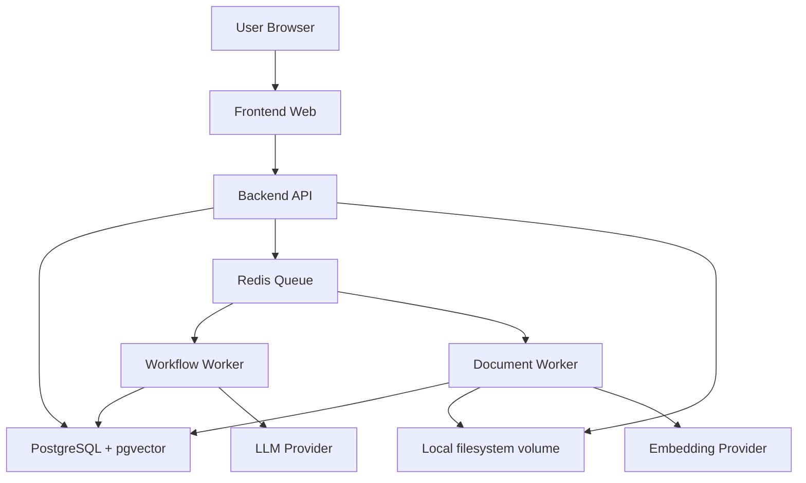

# Agent 工作流平台测试与部署上线设计文档 v0.1

## 1. 文档目标

本文档定义 Agent 工作流平台 MVP 阶段的测试策略、环境规划、部署架构、数据库迁移、后台任务、监控日志、安全检查和上线验收流程。

本文档目标是确保 MVP 不只是能跑通 Demo，而是可以部署到测试环境并支持真实用户试用。

---

## 2. MVP 上线目标

上线目标：

```text
用户可以在测试环境创建并运行工作流
LLM 节点可以稳定调用模型
知识库文档可以上传、处理和检索
API 节点可以调用外部测试接口
Trace 可以定位失败原因
服务异常有日志可查
数据库迁移可重复执行
Secret 不明文暴露
```

当前项目状态：

```text
M0-M5 MVP 核心闭环已基本完成
M6 生产化基础收尾已完成到文档、Compose、migration、worker、ready、smoke 和排障口径清晰的状态
当前适合本地 Compose 复现、测试环境部署验收和小范围试用前准备
当前不声明已经具备企业生产级 KMS、集中监控告警、自动化备份恢复或完整权限体系
```

当前已支持：

```text
Generated workflow code
sync / async run
Knowledge vector retrieve
Intent + Branch
API + Message
Trace code metadata
Trace 节点 input / output 展开
基础 health / ready
本地 Compose 编排
幂等数据库补丁脚本
端到端 smoke
```

当前剩余边界：

```text
更完整权限系统
生产级监控、指标、告警和日志聚合
生产级 secret / KMS、密钥轮换和审计
对象存储、病毒扫描和更严格文件治理
生产级备份恢复、容量规划和发布回滚演练
API 外呼 allowlist / 网关 / 审计策略
```

---

## 3. 测试分层

MVP 测试分为：

```text
单元测试
集成测试
端到端测试
安全测试
性能冒烟测试
部署验收测试
```

---

## 4. 单元测试范围

优先覆盖 Runtime 内核和协议相关逻辑。

### 4.1 GraphValidator

测试点：

```text
缺少 Start Node
多个 Start Node
缺少 End Node
重复 node id
重复 edge id
edge.source 不存在
edge.target 不存在
Start Node 有入边
End Node 有出边
普通节点多出边
Branch target 不存在
Branch target 缺少对应 edge
Branch 出边无法映射回 branches[].target
发布版本包含 enabled: false 节点时失败
Graph 存在环
合法 Graph 通过校验
```

---

### 4.2 VariableResolver

测试点：

```text
解析 {{input.user_query}}
解析 {{variables.kb_context}}
完整变量引用保留数组类型
嵌入字符串变量转字符串
对象和数组转 JSON 字符串
变量不存在时报 variable_not_found
非法路径时报 invalid_variable_path
secrets 只允许服务端解析
config 可引用 input_mapping 后的 node_input 顶层字段
config 中 {{question}} 优先解析为 node_input.question
config 解析后以 resolved_config 传入 NodeExecutor
```

---

### 4.3 MappingEngine

测试点：

```text
input_mapping 生成 node_input
output_mapping 写入 variables
output_mapping 写入 outputs.xxx
target = messages 时追加消息
target = outputs 时 merge
Output Node 不依赖 output_mapping，由 Runtime 将 node_output.outputs merge 到 state.outputs
禁止写 input
禁止写 metadata
禁止写 secrets
```

---

### 4.4 NextNodeResolver

测试点：

```text
普通节点按唯一出边流转
无出边且不是 End Node 失败
Branch Node 根据 target 流转
End Node 结束
```

---

### 4.5 NodeExecutor

优先测试：

```text
InputNodeExecutor
OutputNodeExecutor
BranchNodeExecutor
MessageNodeExecutor
APINodeExecutor 的请求构造
```

LLM 和 Embedding 通过 mock adapter 测试。

---

## 5. 集成测试范围

### 5.1 Workflow 集成测试

测试接口：

```text
POST /api/v1/workflows
PUT /api/v1/workflows/{workflow_id}
POST /api/v1/workflows/{workflow_id}/validate
POST /api/v1/workflows/{workflow_id}/publish
GET /api/v1/workflow-versions/{version_id}
```

验收：

```text
草稿可以保存
非法 Graph 不能发布
合法 Graph 可以发布
发布后 workflow_versions.graph_json 不受草稿修改影响
```

---

### 5.2 Runtime 集成测试

测试接口：

```text
POST /api/v1/workflows/{workflow_id}/run
GET /api/v1/runs/{run_id}
GET /api/v1/runs/{run_id}/node-runs
GET /api/v1/runs/{run_id}/trace
```

验收：

```text
成功运行后 workflow_run.status = completed
失败运行后 workflow_run.status = failed
每个执行节点都有 node_run
node_run.input_json 和 output_json 正常写入
workflow_run.output_json 等于 state.outputs
```

---

### 5.3 Knowledge 集成测试

测试点：

```text
创建知识库
上传 TXT / Markdown 文档
文档处理为 chunks
embedding 写入
retrieve 返回 top_k chunks
失败文档可重试
```

PDF / DOCX 可以放到第二批集成测试。

---

### 5.4 Tool / Secret 集成测试

测试点：

```text
创建 Secret
Secret 列表不返回 value
创建 API Tool
Tool Test 可解析 {{secrets.xxx}}
Trace 不记录 secret 明文
API Node 可调用测试服务
```

---

## 6. 端到端验收用例

## 6.1 简单 LLM 工作流

流程：

```text
Start → Input → LLM → Output → End
```

验收步骤：

```text
1. 创建工作流
2. 拖拽节点并连线
3. 配置 LLM Prompt
4. 保存草稿
5. 发布版本
6. 输入 user_query
7. 运行工作流
8. 查看 answer
9. 查看 Trace
```

通过标准：

```text
workflow_run completed
LLM Node success
Output Node 写入 outputs.answer
Trace 可看到 token usage
```

---

## 6.2 知识库问答工作流

流程：

```text
Start → Input → Knowledge Base → LLM → Output → End
```

通过标准：

```text
文档 indexed
Knowledge Base Node 返回 chunks
LLM Node 生成 answer
Output 返回 answer 和 sources
Trace 显示 returned_chunks
```

---

## 6.3 意图识别分支工作流

流程：

```text
Start → Input → Intent → Branch
                         ├─ refund_request → LLM → Output → End
                         └─ general_question → Knowledge Base → LLM → Output → End
```

通过标准：

```text
Intent 输出 intent 和 confidence
Branch 命中正确 target
未执行分支没有 node_run
执行路径在 Trace 中清晰可见
```

---

## 6.4 API 调用工作流

流程：

```text
Start → Input → API → LLM → Message → Output → End
```

通过标准：

```text
API Node 调用测试接口成功
API 响应写入 variables
LLM 可引用 API 响应
Message 写入 messages
Authorization 已脱敏
```

---

## 7. 测试环境规划

建议至少准备：

```text
local       本地开发
test        测试环境
staging     预发布，可选
production  正式环境，MVP 后期再启用
```

MVP 可先上线：

```text
local
test
```

---

## 8. 本地开发环境

本地依赖：

```text
PostgreSQL + pgvector
Redis，RQ 队列依赖
文件存储：本地文件系统 volume
后端 API 服务
前端 Web 服务
文档处理 worker
工作流运行 worker，可选
```

本地启动顺序：

```text
1. 启动 PostgreSQL
2. 执行数据库迁移
3. 初始化模型配置和测试用户
4. 启动后端 API
5. 启动 worker
6. 启动前端
```

当前推荐本地验收命令：

```powershell
cd "D:\xm\agent flow\agent flow"
npm run check:local
npm run compose:up
npm run compose:ps
npm run smoke:e2e
npm run compose:down
```

命令说明：

```text
npm run check:local    本地工具链、环境和基础检查入口
npm run compose:up     启动 PostgreSQL、Redis、API、Frontend、workflow worker、document worker，并执行幂等 migration
npm run compose:ps     查看 Compose 服务状态
npm run smoke:e2e      跑端到端冒烟，覆盖 generated workflow、sync/async、Knowledge、Intent/Branch、API/Message
npm run compose:down   停止 Compose 环境
```

---

## 9. 测试环境部署架构

MVP 测试环境建议：

```text
Frontend Web
Backend API
Workflow Worker
Document Processing Worker
PostgreSQL + pgvector
Redis
Local filesystem volume
```

部署图：



---

## 9.1 Docker Compose 与生产差异

本地 Compose 部署约定：

```text
Redis 对外端口为 6380，避免和本机常见 6379 冲突
容器内部 Redis 地址仍为 redis://redis:6379/0
API 使用 uvicorn --reload --reload-dir app
Frontend 使用 npm run dev
API reload 只监听 app 目录
backend/generated_workflows 不触发 API reload
generated_workflows 是发布工作流时生成的版本化代码目录
上传文件使用 ./storage/uploads 本地文件系统目录
后端、前端源码以 bind mount 挂载进容器
```

生产环境差异：

```text
应使用正式构建镜像和非 reload 进程
应使用生产 PostgreSQL 和 Redis，不依赖本地默认账号密码
上传文件应放在持久化存储或后续对象存储方案中
应替换 mock/local auth 为真实认证授权
应限制 CORS_ALLOWED_ORIGINS 到真实前端域名
Secret 当前是应用侧加密和脱敏，不等于 KMS
API Node mock 模式仅用于本地和测试；真实 HTTP 外呼仍需生产 allowlist、网关、审计和超时预算
```

Mock / local auth 边界：

```text
当前默认用户由 MOCK_USER_ID 表达，用于本地和测试环境验证 created_by / updated_by / published_by 等字段
这不是完整登录态、组织、项目空间、角色或资源级授权
进入生产前必须接入真实身份系统和权限校验
```

---

## 10. 数据库迁移策略

要求：

```text
所有表结构通过 migration 管理
禁止手工改测试环境表结构
migration 可在空库执行
migration 可在已有库增量执行
seed 数据单独管理
```

MVP seed 数据：

```text
Admin 测试用户
默认 model_provider
默认 chat model
默认 embedding model
示例 Secret，可选
示例工作流模板，可选
```

上线前检查：

```text
migration 已执行
pgvector 扩展已启用
MVP 固定使用 1536 维 embedding，knowledge_chunks.embedding 为 vector(1536)
必要索引已创建
```

已有 PostgreSQL volume 注意事项：

```text
PostgreSQL 只会在首次创建数据卷时执行 /docker-entrypoint-initdb.d
已有 postgres_data volume 不会自动重跑 002 / 003 SQL
保留数据时执行 npm run db:migrate
可以丢弃本地数据时才执行 docker compose down -v
```

---

## 11. 后台任务设计

## 11.1 Workflow Worker

职责：

```text
异步执行 workflow_run
加载 workflow_version
调用 WorkflowExecutor
更新 workflow_run 状态
```

失败处理：

```text
记录 failed
保存 error_code / error_message
不自动无限重试整个 workflow_run
节点内部重试由 Runtime 控制
```

---

## 11.2 Document Processing Worker

职责：

```text
解析文档
切分 chunk
生成 embedding
写入 knowledge_chunks
更新 document status
```

失败处理：

```text
记录 error_stage
记录 error_message
增加 retry_count
支持手动 retry
```

---

## 12. 日志设计

服务日志至少包含：

```text
request_id
user_id
run_id
workflow_id
version_id
node_id
node_type
duration_ms
error_code
error_message
```

日志分类：

```text
api_access
runtime
node_executor
knowledge_processing
provider_call
security
audit
```

敏感信息规则：

```text
Authorization 不进日志
secret value 不进日志
上传文件内容不进日志
LLM Prompt 是否进日志由 TRACE_SAVE_PROMPT 控制
```

---

## 13. 监控指标

MVP 建议采集：

```text
API 请求数
API 错误率
API p95 延迟
workflow_run 数量
workflow_run 成功率
workflow_run 失败率
node_run 失败率
LLM 调用次数
LLM 调用错误率
LLM token 使用量
API Node 调用失败率
文档处理成功率
文档处理失败率
队列积压数量
```

告警建议：

```text
API 错误率过高
workflow_run 失败率过高
文档处理队列积压
LLM Provider 连续失败
数据库连接失败
磁盘或对象存储异常
```

---

## 14. 安全上线检查

必须检查：

```text
AUTH_MODE=mock 时后端可注入 mock current_user
mock user 的 created_by / updated_by / published_by 写入正确
Secret 加密存储
Secret API 不返回 value
Trace 脱敏
API Node 有 timeout
API Node 有响应体大小限制
上传文件大小限制
上传文件类型限制
基于 mock user 的工作流运行权限校验
知识库检索权限过滤
错误响应不暴露堆栈
生产环境关闭调试模式
```

建议检查：

```text
API Node 禁止访问内网地址
LLM Prompt 注入风险提示
审计日志记录发布、运行、Secret 变更
上传文件病毒扫描，后续增强
```

---

## 15. 性能冒烟标准

MVP 不需要大规模压测，但需要冒烟：

```text
工作流列表 100 条内加载正常
单个 workflow graph 100 节点内编辑器不卡顿
简单 LLM 工作流运行成功
10 个并发运行请求服务不崩溃
10 个文档处理任务可以排队执行
单文档 5MB 内可处理
Trace 查询在 2 秒内返回
```

这些不是最终生产指标，而是 MVP 可试用底线。

---

## 16. 发布流程

建议流程：

```text
1. 合并代码到 main 或 release 分支
2. 执行单元测试
3. 执行集成测试
4. 构建前端
5. 构建后端镜像
6. 执行数据库 migration
7. 部署后端 API
8. 部署 worker
9. 部署前端
10. 执行部署验收用例
11. 标记版本
```

生产部署 checklist：

```text
Env / secrets
- 不使用 .env.example 默认密码和开发 SECRET_ENCRYPTION_KEY
- DATABASE_URL 指向目标 PostgreSQL
- REDIS_URL 指向目标 Redis
- SECRET_ENCRYPTION_KEY 长度不少于 32 字符并通过安全渠道分发
- OPENAI_API_KEY 或 active secret openai_api_key 已准备
- CORS_ALLOWED_ORIGINS 限定到实际前端域名
- STORAGE_DIR 指向持久化上传目录
- MAX_UPLOAD_BYTES 和 ALLOWED_UPLOAD_CONTENT_TYPES 已确认

DB migration
- 新库执行 001 / 002 / 003
- 已有库执行 npm run db:migrate 或等价 SQL
- pgvector 扩展可用
- knowledge_chunks.embedding 为当前 1536 维约定
- 发布前完成数据库备份

Worker
- worker-workflow 独立运行并消费异步 workflow run
- worker-document 独立运行并处理 document_processing_jobs
- API 和 worker 使用同一 DATABASE_URL / REDIS_URL / STORAGE_DIR / SECRET_ENCRYPTION_KEY

Health / ready
- /api/v1/health 返回 ok
- /api/v1/ready 返回 ready
- ready checks 中 database / redis / encryption_key / default_model_provider 均为 ok

Smoke
- 部署后执行 npm run smoke:e2e 或等价环境 smoke
- 覆盖 generated workflow、sync/async、Knowledge、Intent/Branch、API/Message、Trace 脱敏

Backup
- PostgreSQL 已备份
- 上传文件目录或对象存储已备份
- 记录镜像 tag、migration 文件、环境变量变更和发布时间

Logs
- API、workflow worker、document worker 日志可查看
- PostgreSQL、Redis 日志可查看
- 当前仓库未内置集中日志平台，生产环境需外部接入

Rollback
- 前端回滚到上一构建
- 后端 API 和 worker 回滚到上一镜像
- 数据库 migration 优先向前兼容，必要时按备份恢复
- workflow_versions 为不可变发布记录，通常不需要回滚历史版本数据
```

回滚策略：

```text
前端可回滚到上一构建
后端可回滚到上一镜像
数据库 migration 尽量向前兼容
发布前备份数据库
workflow_versions 不可变，通常不需要回滚数据
```

---

## 17. 部署验收清单

部署后必须确认：

```text
/health 正常
前端页面可访问
mock user 可用
数据库连接正常
Redis 连接正常
worker 在线
模型配置可读取
Secret 可创建
工作流可创建
工作流可发布
简单 LLM 工作流可运行
Trace 可查询
知识库文档可上传
文档可处理到 indexed
知识库检索可返回 chunks
API Tool Test 可运行
```

当前自动化 / 半自动化验收入口：

```text
npm run check:local
npm run compose:up
npm run compose:ps
npm run smoke:e2e
npm run compose:down
```

当前 smoke e2e 覆盖重点：

```text
Generated workflow code 发布和运行
同步运行
异步运行
Knowledge vector retrieve
Intent + Branch
API + Message
Trace code metadata
Trace 节点 input / output 展开
敏感 header trace 脱敏
```

---

## 17.1 故障排查

Redis 端口：

```text
宿主机访问本地 Compose Redis 使用 localhost:6380
容器内访问 Redis 使用 redis://redis:6379/0
如果 /ready 的 redis 失败，先确认 REDIS_URL 是否处于正确网络上下文
docker compose exec -T redis redis-cli ping 应返回 PONG
```

Docker API：

```text
npm run compose:up 前确认 Docker Desktop 已启动
docker --version、docker compose version、docker compose ps 应正常返回
如果 Docker daemon/API 无响应，等待 Docker Desktop 完成启动或重启 Docker Desktop
```

Async pending：

```text
异步 run 长期 pending 时检查 worker-workflow 是否运行
查看 docker compose logs worker-workflow
检查 /api/v1/ready 的 database 和 redis
确认 API 与 worker 使用同一 DATABASE_URL 和 REDIS_URL
查询 GET /api/v1/runs/{run_id} 和 GET /api/v1/runs/{run_id}/trace 定位状态
```

generated_workflows reload：

```text
Compose API reload 只监听 app 目录
backend/generated_workflows 不触发 API reload
手动修改 generated workflow 后重新运行工作流验证
如果行为仍不确定，重启 API 和 worker 后再验证
生产环境不建议手动修改 generated workflow，应通过重新发布生成新版本目录
```

Postgres volume migration：

```text
已有 postgres_data volume 不会自动重跑 initdb SQL
保留数据时执行 npm run db:migrate
确认可以丢弃本地数据库时才执行 docker compose down -v
缺字段或缺 generated code metadata 时优先检查 002 / 003 是否已应用
```

---

## 18. MVP 缺陷分级

### P0

```text
无法创建工作流
无法发布工作流
Runtime 无法运行
运行成功但无 Trace
Secret 明文泄露
数据库 migration 失败
```

### P1

```text
知识库无法处理文档
API Node 无法调用
Branch 路由错误
运行失败无错误信息
前端编辑器保存丢失节点
```

### P2

```text
页面体验问题
错误提示不够清晰
Trace 展示不够友好
列表筛选异常
非核心样式问题
```

---

## 19. 第一版上线标准

MVP 可以进入测试环境试用的标准：

```text
核心接口完成
核心数据库迁移完成
Runtime 最小闭环通过
四个端到端用例至少通过前三个
Trace 可定位节点失败
Secret 不明文暴露
知识库基础处理可用
部署文档可执行
```

MVP 可以进入小范围真实用户试用的标准：

```text
四个端到端用例全部通过
P0 缺陷为 0
P1 缺陷有明确规避方案
日志和错误码可定位问题
测试环境稳定运行至少 3 天
```

---

## 20. 结论

测试与部署的核心目标是让 MVP 具备真实试用能力。

第一版上线前必须守住：

```text
Runtime 能跑
Trace 能查
错误能定位
Secret 不泄露
文档能检索
迁移可重复
部署可复现
```

只要这些底线稳定，后续再扩展复杂节点和企业级能力时，平台就不会被基础工程问题拖住。
