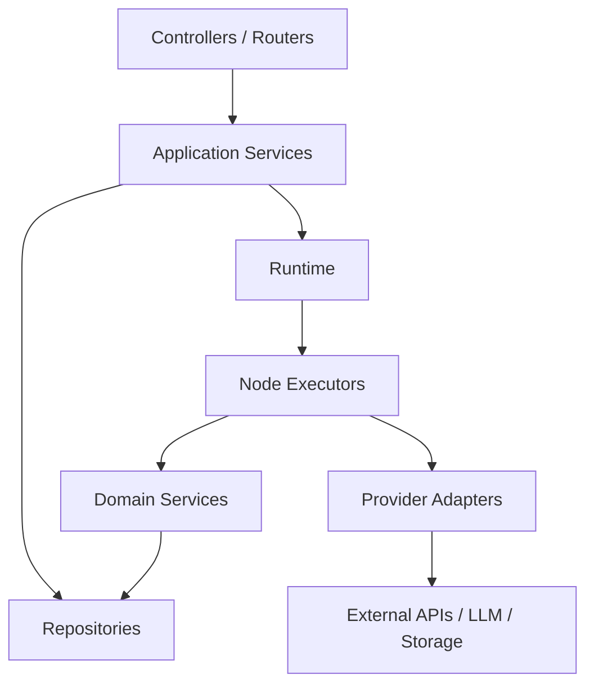

# Agent 工作流平台后端模块与项目结构设计文档 v0.1

## 1. 文档目标

本文档定义 Agent 工作流平台 MVP 后端的模块划分、项目目录、分层架构、服务边界、核心类职责和后续扩展方式。

MVP 阶段后端技术栈已确定为：

```text
API：FastAPI
Worker：RQ + Redis
Database：PostgreSQL + pgvector
File Storage：本地文件系统 volume
Deployment：Docker Compose 单机
```

此前讨论过的 NestJS、Celery、RabbitMQ、MinIO、Kubernetes 等方案不进入 MVP，只作为后续演进或团队技术栈变化时的备选。

---

## 2. 后端设计原则

```text
模块边界清晰：Workflow、Runtime、Knowledge、Tool、Model、Secret 各自独立
Runtime 内核稳定：节点执行协议不依赖具体 API Controller
Provider 可替换：LLM、Embedding、存储、队列、HTTP Client 都通过适配层
Graph 版本不可变：Runtime 只读取 workflow_versions
Trace 全链路记录：workflow_run 和 node_run 是调试主入口
Secret 服务端解析：任何前端响应和 Trace 都不能暴露真实密钥
业务逻辑下沉 Service：Controller 只做参数接收和响应
```

---

## 3. 总体后端分层

```text
API Layer
  Controller / Router
  Request DTO
  Response DTO
  Auth Guard
  Validation Pipe

Application Layer
  WorkflowService
  WorkflowPublishService
  WorkflowRunService
  KnowledgeBaseService
  ToolService
  SecretService
  ModelService

Runtime Layer
  WorkflowExecutor
  GraphLoader
  GraphValidator
  StateManager
  VariableResolver
  MappingEngine
  NodeExecutorRegistry
  NodeExecutors
  TraceRecorder

Domain Layer
  Workflow
  WorkflowVersion
  WorkflowRun
  NodeRun
  KnowledgeBase
  Document
  Tool
  Secret
  Error Types

Infrastructure Layer
  Database Repositories
  LLM Provider Adapters
  Embedding Provider Adapters
  Vector Store
  Local File Storage
  Queue Worker
  HTTP Client
  Crypto
  Logger
```

---

## 4. 核心模块划分

## 4.1 Auth Module

职责：

```text
MVP mock 模式下注入默认用户
后续 JWT 模式解析用户身份
提供 current_user
基础角色校验
运行权限校验入口
```

MVP 默认用户：

```json
{
  "id": 1,
  "email": "admin@example.com",
  "username": "admin",
  "display_name": "MVP Admin",
  "role": "admin"
}
```

环境变量：

```text
AUTH_MODE=mock
MOCK_USER_ID=1
MOCK_USER_ROLE=admin
```

MVP 支持：

```text
Admin
Editor
Viewer
```

主要组件：

```text
AuthGuard
CurrentUser
PermissionService
```

---

## 4.2 Workflow Module

职责：

```text
工作流 CRUD
草稿保存
Graph 弱校验
发布版本
版本列表与详情
软删除和归档
```

主要组件：

```text
WorkflowController
WorkflowService
WorkflowPublishService
WorkflowRepository
WorkflowVersionRepository
GraphValidator
```

关键规则：

```text
保存草稿只写 workflows.draft_graph_json
发布时复制 draft_graph_json 到 workflow_versions.graph_json
发布版本不可变
```

---

## 4.3 Runtime Module

职责：

```text
创建 workflow_run
执行已发布 workflow_version
执行节点
维护 State
记录 Trace
处理错误、重试、超时
```

主要组件：

```text
WorkflowRunController
WorkflowRunService
WorkflowExecutor
GraphLoader
StateManager
VariableResolver
MappingEngine
NextNodeResolver
RetryController
TimeoutController
TraceRecorder
NodeExecutorRegistry
```

节点执行器：

```text
StartNodeExecutor
InputNodeExecutor
LLMNodeExecutor
KnowledgeBaseNodeExecutor
IntentNodeExecutor
BranchNodeExecutor
APINodeExecutor
MessageNodeExecutor
OutputNodeExecutor
EndNodeExecutor
```

---

## 4.4 Knowledge Module

职责：

```text
知识库 CRUD
文档上传
文档解析
chunk 切分
embedding 生成
向量检索
文档处理任务
```

主要组件：

```text
KnowledgeBaseController
DocumentController
KnowledgeBaseService
DocumentService
DocumentProcessingService
ChunkingService
EmbeddingService
RetrievalService
VectorStore
ObjectStorage
```

MVP 支持文件：

```text
PDF
DOCX
TXT
Markdown
```

---

## 4.5 Tool Module

职责：

```text
API 工具配置
工具测试
API Node 调用支持
请求参数解析
响应提取
敏感信息脱敏
```

主要组件：

```text
ToolController
ToolService
ToolRepository
APIToolExecutor
SafeHttpClient
ResponseExtractor
```

---

## 4.6 Model Module

职责：

```text
模型 Provider 管理
模型配置管理
LLM Client 统一入口
Embedding Client 统一入口
token usage 归一化
```

主要组件：

```text
ModelController
ModelProviderService
ModelConfigService
LLMClient
EmbeddingClient
ProviderAdapterRegistry
OpenAIAdapter
CustomProviderAdapter
```

---

## 4.7 Secret Module

职责：

```text
Secret 加密存储
Secret 引用解析
Secret 响应脱敏
密钥更新
```

主要组件：

```text
SecretController
SecretService
SecretRepository
CryptoService
SecretResolver
```

关键规则：

```text
API 响应不返回 value
graph_json 不保存真实密钥
Trace 不记录真实密钥
Runtime 通过 SecretResolver 解析 {{secrets.xxx}}
```

---

## 4.8 Audit Module

职责：

```text
记录关键操作
记录发布
记录运行
记录 Secret 变更
记录工具测试
```

主要组件：

```text
AuditService
AuditRepository
AuditInterceptor
```

---

## 5. 非 MVP 备选：NestJS 版本

本节仅作为历史备选参考。MVP 不采用 NestJS，实际开发以 FastAPI 目录结构为准。

```text
src/
  main.ts
  app.module.ts

  common/
    config/
      env.schema.ts
      app.config.ts
      database.config.ts
    errors/
      app-error.ts
      error-codes.ts
      exception-filter.ts
    guards/
      auth.guard.ts
      roles.guard.ts
    interceptors/
      request-id.interceptor.ts
      audit.interceptor.ts
    pipes/
      validation.pipe.ts
    utils/
      json-path.ts
      redactor.ts
      time.ts

  modules/
    auth/
      auth.module.ts
      current-user.decorator.ts
      permission.service.ts

    workflow/
      workflow.module.ts
      workflow.controller.ts
      workflow.service.ts
      workflow-publish.service.ts
      graph-validator.service.ts
      dto/
        create-workflow.dto.ts
        update-workflow.dto.ts
        validate-graph.dto.ts
        publish-workflow.dto.ts
      repositories/
        workflow.repository.ts
        workflow-version.repository.ts

    runtime/
      runtime.module.ts
      workflow-run.controller.ts
      workflow-run.service.ts
      executor/
        workflow-executor.ts
        graph-loader.ts
        state-manager.ts
        variable-resolver.ts
        mapping-engine.ts
        next-node-resolver.ts
        retry-controller.ts
        timeout-controller.ts
        trace-recorder.ts
      node-executors/
        node-executor.interface.ts
        node-executor.registry.ts
        start-node.executor.ts
        input-node.executor.ts
        llm-node.executor.ts
        knowledge-base-node.executor.ts
        intent-node.executor.ts
        branch-node.executor.ts
        api-node.executor.ts
        message-node.executor.ts
        output-node.executor.ts
        end-node.executor.ts
      dto/
        run-workflow.dto.ts
      repositories/
        workflow-run.repository.ts
        node-run.repository.ts

    knowledge/
      knowledge.module.ts
      knowledge-base.controller.ts
      document.controller.ts
      knowledge-base.service.ts
      document.service.ts
      document-processing.service.ts
      retrieval.service.ts
      chunking.service.ts
      parsers/
        pdf.parser.ts
        docx.parser.ts
        txt.parser.ts
        markdown.parser.ts
      repositories/
        knowledge-base.repository.ts
        document.repository.ts
        knowledge-chunk.repository.ts
        document-processing-job.repository.ts

    tool/
      tool.module.ts
      tool.controller.ts
      tool.service.ts
      safe-http-client.ts
      response-extractor.ts
      repositories/
        tool.repository.ts

    model/
      model.module.ts
      model.controller.ts
      model-provider.service.ts
      model-config.service.ts
      llm-client.ts
      embedding-client.ts
      adapters/
        provider-adapter.interface.ts
        openai.adapter.ts
        custom-provider.adapter.ts
      repositories/
        model-provider.repository.ts
        model-config.repository.ts

    secret/
      secret.module.ts
      secret.controller.ts
      secret.service.ts
      secret-resolver.ts
      crypto.service.ts
      repositories/
        secret.repository.ts

    audit/
      audit.module.ts
      audit.service.ts
      audit.repository.ts

  database/
    migrations/
    seeds/
    database.module.ts

  workers/
    document-processing.worker.ts
    workflow-run.worker.ts
```

---

## 6. MVP 推荐目录结构：FastAPI 版本

MVP 采用 FastAPI，推荐目录：

```text
app/
  main.py

  core/
    config.py
    logging.py
    security.py
    errors.py
    response.py

  api/
    deps.py
    v1/
      router.py
      workflows.py
      workflow_runs.py
      knowledge_bases.py
      documents.py
      tools.py
      models.py
      secrets.py
      node_types.py

  schemas/
    workflow.py
    workflow_run.py
    graph.py
    node.py
    knowledge.py
    tool.py
    model.py
    secret.py
    common.py

  models/
    user.py
    workflow.py
    workflow_version.py
    workflow_run.py
    node_run.py
    knowledge_base.py
    document.py
    knowledge_chunk.py
    document_processing_job.py
    tool.py
    model_provider.py
    model_config.py
    secret.py
    audit_log.py

  repositories/
    workflow_repository.py
    workflow_version_repository.py
    workflow_run_repository.py
    node_run_repository.py
    knowledge_repository.py
    document_repository.py
    tool_repository.py
    model_repository.py
    secret_repository.py
    audit_repository.py

  services/
    auth/
      permission_service.py
    workflow/
      workflow_service.py
      workflow_publish_service.py
      graph_validator.py
    runtime/
      workflow_run_service.py
      workflow_executor.py
      graph_loader.py
      state_manager.py
      variable_resolver.py
      mapping_engine.py
      next_node_resolver.py
      retry_controller.py
      timeout_controller.py
      trace_recorder.py
      node_executors/
        base.py
        registry.py
        start_node.py
        input_node.py
        llm_node.py
        knowledge_base_node.py
        intent_node.py
        branch_node.py
        api_node.py
        message_node.py
        output_node.py
        end_node.py
    knowledge/
      knowledge_base_service.py
      document_service.py
      document_processing_service.py
      retrieval_service.py
      chunking_service.py
      parsers/
        pdf_parser.py
        docx_parser.py
        txt_parser.py
        markdown_parser.py
    tool/
      tool_service.py
      safe_http_client.py
      response_extractor.py
    model/
      model_provider_service.py
      model_config_service.py
      llm_client.py
      embedding_client.py
      adapters/
        base.py
        openai_adapter.py
        custom_provider_adapter.py
    secret/
      secret_service.py
      secret_resolver.py
      crypto_service.py
    audit/
      audit_service.py

  infra/
    db/
      session.py
      migrations/
    queue/
      rq_app.py
      tasks.py
    storage/
      local_file_storage.py
    vector/
      pgvector_store.py
    http/
      http_client.py

  workers/
    document_processing_worker.py
    workflow_run_worker.py

  tests/
    unit/
    integration/
```

---

## 7. 模块依赖关系

推荐依赖方向：

```text
Controller → Application Service → Repository / Runtime / Provider Adapter
Runtime → NodeExecutor → Domain Service / Provider Adapter
Provider Adapter → 外部服务
Repository → Database
```

禁止依赖：

```text
Repository 不依赖 Controller
NodeExecutor 不直接依赖 HTTP Controller
Provider Adapter 不依赖业务 Service
前端 Graph 结构不直接绕过后端校验进入 Runtime
```

核心依赖图：



---

## 8. 核心服务职责

## 8.1 WorkflowService

职责：

```text
create_workflow
list_workflows
get_workflow
update_workflow
delete_workflow
```

不负责：

```text
执行工作流
调用 LLM
处理知识库文档
```

---

## 8.2 WorkflowPublishService

职责：

```text
读取 draft_graph_json
调用 GraphValidator 强校验
计算下一个 version
创建 workflow_version
更新 current_version_id
写 audit_logs
```

---

## 8.3 WorkflowRunService

职责：

```text
接收运行请求
选择 version_id
创建 workflow_run
触发同步或异步 Runtime
查询 run 和 trace
取消 run
```

---

## 8.4 WorkflowExecutor

职责：

```text
执行工作流版本
调度节点执行
维护 State
处理下一节点
处理异常
调用 TraceRecorder
```

不负责：

```text
HTTP 参数校验
用户登录认证
前端 Graph 编辑
```

---

## 8.5 TraceRecorder

职责：

```text
创建 workflow_run
更新 workflow_run 状态
创建 node_run
更新 node_run 成功或失败
写入 metadata_json
调用 Redactor 脱敏
```

---

## 8.6 SecretResolver

职责：

```text
识别 {{secrets.xxx}}
查询 Secret
解密 value
返回给 Runtime 内部使用
避免 value 进入 Trace
```

---

## 8.7 RetrievalService

职责：

```text
接收 query
生成 query embedding
执行向量检索
过滤权限和状态
返回 chunk 和 source
```

---

## 9. NodeExecutor 设计

统一接口：

```typescript
interface NodeExecutor {
  execute(params: {
    node: WorkflowNode;
    nodeInput: Record<string, unknown>;
    state: WorkflowState;
    context: RuntimeContext;
  }): Promise<Record<string, unknown>>;
}
```

或 Python：

```python
class NodeExecutor:
    async def execute(self, node, node_input, state, context) -> dict:
        ...
```

约束：

```text
NodeExecutor 不直接修改 State
NodeExecutor 返回 JSON-serializable object
Runtime 根据 output_mapping 写 State
NodeExecutor 抛出标准 RuntimeNodeError
```

---

## 10. GraphValidator 设计

建议拆分：

```text
SchemaValidator       校验 JSON 基础结构
NodeValidator         校验节点字段和 config schema
EdgeValidator         校验边合法性
ConnectivityValidator 校验连通性
BranchValidator       校验 Branch target
CycleValidator        校验 MVP 不支持环
```

校验入口：

```text
validate_draft(graph)
validate_publish(graph)
validate_run(graph)
```

---

## 11. 变量解析器设计

核心类：

```text
VariableResolver
JsonPathReader
SecretResolver
Redactor
```

流程：

```text
1. 扫描字符串中的 {{...}}
2. 判断是否完整变量引用
3. 按根域读取 State 或 Secret
4. 保留类型或转字符串
5. 递归处理 object / array
```

严格模式：

```text
变量不存在直接抛 variable_not_found
非法路径直接抛 invalid_variable_path
secrets 只能在服务端执行时解析
```

---

## 12. Repository 设计

每个 Repository 只负责数据库读写：

```text
WorkflowRepository
WorkflowVersionRepository
WorkflowRunRepository
NodeRunRepository
KnowledgeBaseRepository
DocumentRepository
KnowledgeChunkRepository
ToolRepository
ModelConfigRepository
SecretRepository
AuditRepository
```

Repository 不应包含：

```text
Runtime 执行逻辑
LLM 调用逻辑
权限策略
复杂业务编排
```

---

## 13. Worker 设计

MVP 建议两个后台 worker：

```text
workflow-run worker
document-processing worker
```

### 13.1 workflow-run worker

用于异步工作流运行：

```text
接收 run_id
加载 workflow_run
加载 workflow_version
执行 WorkflowExecutor
更新运行状态
```

---

### 13.2 document-processing worker

用于文档处理：

```text
接收 document_id
解析文档
切分 chunk
生成 embedding
写入 knowledge_chunks
更新 document status
```

---

## 14. Provider Adapter 设计

### 14.1 LLM Provider Adapter

统一接口：

```text
chat(messages, model, temperature, max_tokens) → text + usage
```

适配器：

```text
OpenAIAdapter
LiteLLMAdapter，可选
CustomProviderAdapter
```

---

### 14.2 Embedding Provider Adapter

统一接口：

```text
embed(texts, model) → vectors
```

注意：

```text
embedding 维度必须和 knowledge_chunks.embedding vector(n) 一致
不同 embedding model 对应不同索引时，后续需要迁移策略
```

---

### 14.3 File Storage Adapter

统一接口：

```text
put_file
get_file
delete_file
get_signed_url
```

MVP 支持：

```text
LocalStorage
本地文件系统 volume
```

后续可切换：

```text
MinIO / S3 / OSS
```

---

## 15. 配置项设计

环境变量建议：

```text
APP_ENV
APP_PORT
DATABASE_URL
REDIS_URL
FILE_STORAGE_ROOT
UPLOAD_MAX_FILE_SIZE_MB
SECRET_ENCRYPTION_KEY
DEFAULT_LLM_PROVIDER
DEFAULT_CHAT_MODEL
DEFAULT_EMBEDDING_MODEL
MAX_UPLOAD_FILE_SIZE_MB
API_NODE_TIMEOUT_SECONDS
TRACE_SAVE_PROMPT
```

安全要求：

```text
SECRET_ENCRYPTION_KEY 不进入代码仓库
生产环境必须使用强随机密钥
模型 API Key 通过 secrets 表或环境变量管理
```

---

## 16. 测试策略

## 16.1 单元测试

优先覆盖：

```text
GraphValidator
VariableResolver
MappingEngine
NextNodeResolver
RetryController
BranchNodeExecutor
SecretResolver
Redactor
```

---

## 16.2 集成测试

优先覆盖：

```text
Workflow CRUD
Publish
Run API
Trace API
Knowledge retrieve
Tool test
```

---

## 16.3 端到端测试

必须覆盖：

```text
Start → Input → LLM → Output → End
Start → Input → Knowledge Base → LLM → Output → End
Start → Input → Intent → Branch → LLM/API → Output → End
```

---

## 17. 推荐实现顺序

```text
1. common / config / error / logger
2. database / migration / repositories
3. workflow module
4. graph validator
5. runtime core
6. node executors 基础节点
7. model module
8. run api / trace api
9. frontend 对接所需 node-types schema api
10. knowledge module
11. tool / secret module
12. API / Branch / Intent / Message 节点
13. worker
14. 安全、审计、测试、部署
```

---

## 18. 后续扩展方式

新增节点时只需要：

```text
1. 在 Node Protocol 中定义 type 和 config schema
2. 增加前端 form_schema
3. 增加 NodeExecutor
4. 注册到 NodeExecutorRegistry
5. 增加 GraphValidator 校验规则
6. 增加 Trace metadata 规范
7. 增加测试用例
```

不应该修改：

```text
WorkflowExecutor 主循环
State 基础结构
workflow_versions 存储方式
node_runs Trace 基础结构
```

---

## 19. 结论

后端第一版的关键是把三层边界稳定住：

```text
API 层负责接收请求
Service 层负责编排业务
Runtime 层负责执行节点协议
Infrastructure 层负责外部资源适配
```

其中最重要的长期资产是：

```text
GraphValidator
WorkflowExecutor
VariableResolver
MappingEngine
NodeExecutorRegistry
TraceRecorder
```

这几个组件稳定后，后续增加数据库节点、记忆节点、信息收集节点、循环节点、代码节点和人工审批节点，都会变成可控的增量开发。
