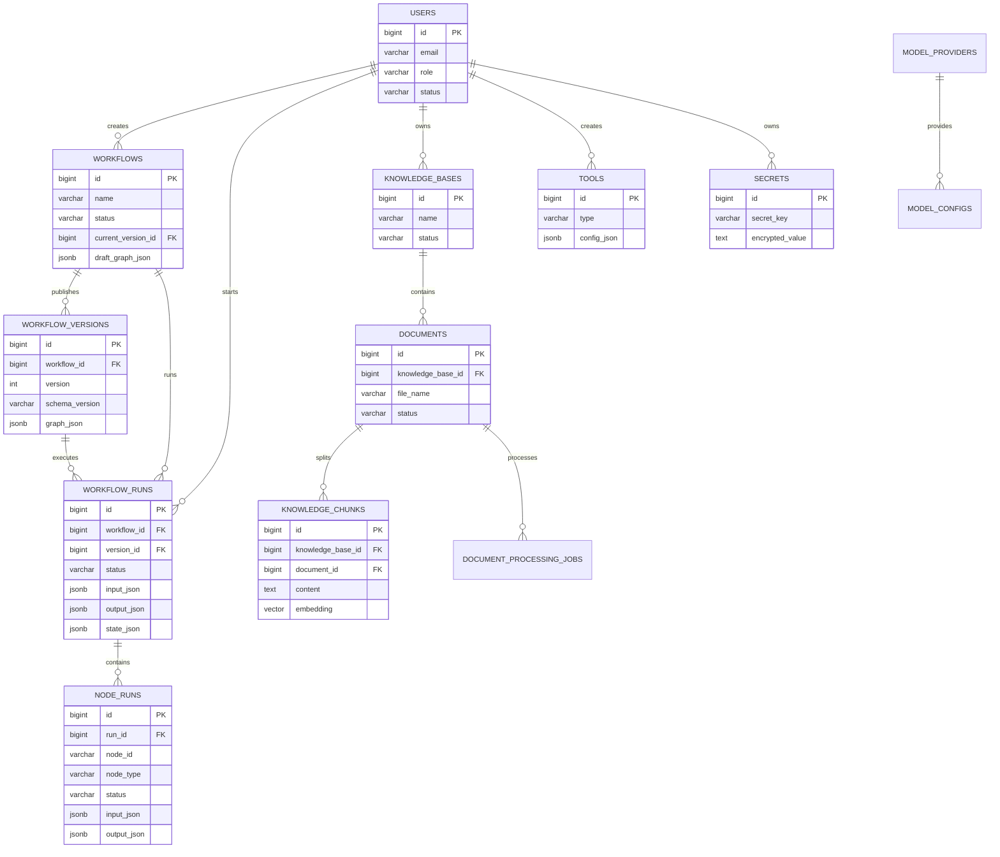

# Agent 工作流平台数据库 ER 设计文档 v0.1

## 1. 文档目标

本文档基于现有三份设计文档，补充 Agent 工作流平台 MVP 阶段的数据库 ER 设计、核心表结构、索引、约束、状态枚举和后续扩展点。

本文档服务于：

```text
后端数据模型设计
数据库迁移脚本编写
API 接口落表
Runtime 执行状态持久化
Trace 与调试查询
知识库文档处理与检索
```

---

## 2. MVP 数据库边界

MVP 必须支持：

```text
用户基础信息
工作流草稿保存
工作流发布版本
工作流运行记录
节点运行 Trace
知识库、文档、chunk、embedding
文档处理任务
API 工具配置
模型配置
Secret 引用
基础审计日志
```

MVP 暂不完整实现：

```text
复杂组织架构
完整 RBAC
多租户计费
多人协同编辑
插件市场
节点 SDK 市场
复杂审批流
调度任务系统
```

---

## 3. 设计原则

```text
发布版本不可变：workflow_versions.graph_json 发布后不再修改
草稿可编辑：workflows.draft_graph_json 保存编辑器当前图
运行绑定版本：workflow_runs 永远绑定具体 workflow_version
Trace 可追踪：每次节点执行都写 node_runs
配置 JSON 化：Graph、节点配置、工具配置优先使用 JSONB
核心字段可索引：状态、创建人、workflow_id、run_id 等必须建索引
Secret 不明文外泄：节点和工具只保存 secret 引用，不保存真实密钥
知识库独立演进：文档处理和向量索引可以异步扩展
```

---

## 4. 总体 ER 图



---

## 5. 状态枚举

### 5.1 workflow.status

```text
draft       草稿
published   已发布
archived    已归档
```

### 5.2 workflow_runs.status

```text
pending
running
completed
failed
cancelled
```

MVP 暂不支持 `paused`、`waiting_for_user`、`waiting_for_approval`，但后续可加入。

### 5.3 node_runs.status

```text
running
success
failed
skipped
retrying
```

MVP 第一阶段至少实现：

```text
running
success
failed
```

### 5.4 documents.status

```text
uploaded
parsing
chunking
embedding
indexed
failed
deleted
```

### 5.5 document_processing_jobs.status

```text
pending
running
success
failed
cancelled
```

---

## 6. 核心表结构

## 6.1 users

MVP 使用轻量用户表，后续可扩展组织、团队、成员关系和完整 RBAC。

```sql
CREATE TABLE users (
  id BIGSERIAL PRIMARY KEY,
  email VARCHAR(255) UNIQUE,
  username VARCHAR(128),
  display_name VARCHAR(128),
  role VARCHAR(32) NOT NULL DEFAULT 'editor',
  status VARCHAR(32) NOT NULL DEFAULT 'active',
  created_at TIMESTAMP NOT NULL DEFAULT CURRENT_TIMESTAMP,
  updated_at TIMESTAMP NOT NULL DEFAULT CURRENT_TIMESTAMP
);

CREATE INDEX idx_users_status ON users(status);
CREATE INDEX idx_users_role ON users(role);
```

---

## 6.2 workflows

`workflows` 保存工作流主信息和当前草稿图。草稿图允许被编辑，发布时复制到 `workflow_versions.graph_json`。

```sql
CREATE TABLE workflows (
  id BIGSERIAL PRIMARY KEY,
  name VARCHAR(255) NOT NULL,
  description TEXT,
  status VARCHAR(32) NOT NULL DEFAULT 'draft',
  current_version_id BIGINT,
  draft_graph_json JSONB,
  created_by BIGINT,
  updated_by BIGINT,
  created_at TIMESTAMP NOT NULL DEFAULT CURRENT_TIMESTAMP,
  updated_at TIMESTAMP NOT NULL DEFAULT CURRENT_TIMESTAMP,
  archived_at TIMESTAMP,
  deleted_at TIMESTAMP
);

CREATE INDEX idx_workflows_status ON workflows(status);
CREATE INDEX idx_workflows_created_by ON workflows(created_by);
CREATE INDEX idx_workflows_updated_at ON workflows(updated_at);
CREATE INDEX idx_workflows_deleted_at ON workflows(deleted_at);
CREATE INDEX idx_workflows_draft_graph_gin ON workflows USING GIN(draft_graph_json);
```

说明：

```text
draft_graph_json 是编辑器保存草稿使用
current_version_id 指向当前已发布版本
deleted_at 用于软删除
archived_at 用于归档
```

---

## 6.3 workflow_versions

发布版本不可变。Runtime 只加载 `workflow_versions.graph_json`。

```sql
CREATE TABLE workflow_versions (
  id BIGSERIAL PRIMARY KEY,
  workflow_id BIGINT NOT NULL,
  version INT NOT NULL,
  schema_version VARCHAR(32) NOT NULL DEFAULT '1.0',
  graph_json JSONB NOT NULL,
  graph_hash VARCHAR(128),
  release_note TEXT,
  published_by BIGINT,
  created_at TIMESTAMP NOT NULL DEFAULT CURRENT_TIMESTAMP,
  UNIQUE (workflow_id, version)
);

CREATE INDEX idx_workflow_versions_workflow_id ON workflow_versions(workflow_id);
CREATE INDEX idx_workflow_versions_created_at ON workflow_versions(created_at);
CREATE INDEX idx_workflow_versions_graph_gin ON workflow_versions USING GIN(graph_json);
```

建议约束：

```text
同一个 workflow_id 下 version 从 1 自增
发布后不允许 UPDATE graph_json
如需修改，创建新的 version
```

---

## 6.4 workflow_runs

记录一次工作流运行。

```sql
CREATE TABLE workflow_runs (
  id BIGSERIAL PRIMARY KEY,
  workflow_id BIGINT NOT NULL,
  version_id BIGINT NOT NULL,
  status VARCHAR(32) NOT NULL DEFAULT 'pending',
  trigger_type VARCHAR(32) NOT NULL DEFAULT 'manual',
  input_json JSONB,
  output_json JSONB,
  state_json JSONB,
  error_code VARCHAR(128),
  error_message TEXT,
  created_by BIGINT,
  started_at TIMESTAMP,
  ended_at TIMESTAMP,
  created_at TIMESTAMP NOT NULL DEFAULT CURRENT_TIMESTAMP,
  updated_at TIMESTAMP NOT NULL DEFAULT CURRENT_TIMESTAMP
);

CREATE INDEX idx_workflow_runs_workflow_id ON workflow_runs(workflow_id);
CREATE INDEX idx_workflow_runs_version_id ON workflow_runs(version_id);
CREATE INDEX idx_workflow_runs_status ON workflow_runs(status);
CREATE INDEX idx_workflow_runs_created_by ON workflow_runs(created_by);
CREATE INDEX idx_workflow_runs_created_at ON workflow_runs(created_at);
```

`trigger_type` MVP 支持：

```text
manual
api
test
```

后续可扩展：

```text
schedule
webhook
batch
```

---

## 6.5 node_runs

记录节点执行 Trace。重试时建议每次 attempt 生成一条 `node_runs`，通过 `attempt` 区分。

```sql
CREATE TABLE node_runs (
  id BIGSERIAL PRIMARY KEY,
  run_id BIGINT NOT NULL,
  node_id VARCHAR(128) NOT NULL,
  node_type VARCHAR(64) NOT NULL,
  node_name VARCHAR(255),
  status VARCHAR(32) NOT NULL,
  attempt INT NOT NULL DEFAULT 1,
  input_json JSONB,
  output_json JSONB,
  error_code VARCHAR(128),
  error_message TEXT,
  duration_ms INT,
  metadata_json JSONB,
  started_at TIMESTAMP,
  ended_at TIMESTAMP,
  created_at TIMESTAMP NOT NULL DEFAULT CURRENT_TIMESTAMP
);

CREATE INDEX idx_node_runs_run_id ON node_runs(run_id);
CREATE INDEX idx_node_runs_node_id ON node_runs(node_id);
CREATE INDEX idx_node_runs_node_type ON node_runs(node_type);
CREATE INDEX idx_node_runs_status ON node_runs(status);
CREATE INDEX idx_node_runs_created_at ON node_runs(created_at);
CREATE INDEX idx_node_runs_metadata_gin ON node_runs USING GIN(metadata_json);
```

`metadata_json` 示例：

```json
{
  "model": "gpt-4.1-mini",
  "prompt_tokens": 1000,
  "completion_tokens": 300,
  "total_tokens": 1300,
  "estimated_cost": 0.01
}
```

---

## 6.6 knowledge_bases

```sql
CREATE TABLE knowledge_bases (
  id BIGSERIAL PRIMARY KEY,
  name VARCHAR(255) NOT NULL,
  description TEXT,
  status VARCHAR(32) NOT NULL DEFAULT 'active',
  embedding_model VARCHAR(255),
  config_json JSONB,
  created_by BIGINT,
  created_at TIMESTAMP NOT NULL DEFAULT CURRENT_TIMESTAMP,
  updated_at TIMESTAMP NOT NULL DEFAULT CURRENT_TIMESTAMP,
  deleted_at TIMESTAMP
);

CREATE INDEX idx_knowledge_bases_status ON knowledge_bases(status);
CREATE INDEX idx_knowledge_bases_created_by ON knowledge_bases(created_by);
CREATE INDEX idx_knowledge_bases_deleted_at ON knowledge_bases(deleted_at);
```

`config_json` 示例：

```json
{
  "chunk_size_tokens": 500,
  "chunk_overlap_tokens": 80,
  "default_top_k": 5,
  "score_threshold": 0.65
}
```

---

## 6.7 documents

```sql
CREATE TABLE documents (
  id BIGSERIAL PRIMARY KEY,
  knowledge_base_id BIGINT NOT NULL,
  file_name VARCHAR(512) NOT NULL,
  file_type VARCHAR(64),
  file_size BIGINT,
  storage_url TEXT,
  content_hash VARCHAR(128),
  status VARCHAR(64) NOT NULL DEFAULT 'uploaded',
  error_stage VARCHAR(64),
  error_message TEXT,
  uploaded_by BIGINT,
  metadata_json JSONB,
  created_at TIMESTAMP NOT NULL DEFAULT CURRENT_TIMESTAMP,
  updated_at TIMESTAMP NOT NULL DEFAULT CURRENT_TIMESTAMP,
  deleted_at TIMESTAMP
);

CREATE INDEX idx_documents_kb_id ON documents(knowledge_base_id);
CREATE INDEX idx_documents_status ON documents(status);
CREATE INDEX idx_documents_uploaded_by ON documents(uploaded_by);
CREATE INDEX idx_documents_content_hash ON documents(content_hash);
CREATE INDEX idx_documents_metadata_gin ON documents USING GIN(metadata_json);
```

---

## 6.8 knowledge_chunks

如果使用 PostgreSQL + pgvector：

```sql
CREATE EXTENSION IF NOT EXISTS vector;

CREATE TABLE knowledge_chunks (
  id BIGSERIAL PRIMARY KEY,
  knowledge_base_id BIGINT NOT NULL,
  document_id BIGINT NOT NULL,
  chunk_index INT NOT NULL,
  content TEXT NOT NULL,
  token_count INT,
  embedding vector(1536),
  status VARCHAR(64) NOT NULL DEFAULT 'created',
  metadata_json JSONB,
  created_at TIMESTAMP NOT NULL DEFAULT CURRENT_TIMESTAMP,
  updated_at TIMESTAMP NOT NULL DEFAULT CURRENT_TIMESTAMP
);

CREATE INDEX idx_chunks_kb_id ON knowledge_chunks(knowledge_base_id);
CREATE INDEX idx_chunks_document_id ON knowledge_chunks(document_id);
CREATE INDEX idx_chunks_status ON knowledge_chunks(status);
CREATE INDEX idx_chunks_metadata_gin ON knowledge_chunks USING GIN(metadata_json);
CREATE UNIQUE INDEX uk_chunks_document_index ON knowledge_chunks(document_id, chunk_index);
```

向量索引建议：

```sql
CREATE INDEX idx_chunks_embedding_hnsw
ON knowledge_chunks
USING hnsw (embedding vector_cosine_ops);
```

如果 pgvector 版本或数据规模暂不适合 HNSW，可先不建向量索引，后续迁移。

---

## 6.9 document_processing_jobs

```sql
CREATE TABLE document_processing_jobs (
  id BIGSERIAL PRIMARY KEY,
  document_id BIGINT NOT NULL,
  job_type VARCHAR(64) NOT NULL,
  status VARCHAR(64) NOT NULL DEFAULT 'pending',
  error_stage VARCHAR(64),
  error_message TEXT,
  retry_count INT NOT NULL DEFAULT 0,
  started_at TIMESTAMP,
  ended_at TIMESTAMP,
  created_at TIMESTAMP NOT NULL DEFAULT CURRENT_TIMESTAMP,
  updated_at TIMESTAMP NOT NULL DEFAULT CURRENT_TIMESTAMP
);

CREATE INDEX idx_doc_jobs_document_id ON document_processing_jobs(document_id);
CREATE INDEX idx_doc_jobs_status ON document_processing_jobs(status);
CREATE INDEX idx_doc_jobs_job_type ON document_processing_jobs(job_type);
CREATE INDEX idx_doc_jobs_created_at ON document_processing_jobs(created_at);
```

`job_type` MVP 支持：

```text
parse
chunk
embedding
reindex
```

---

## 6.10 tools

MVP 主要用于 API 工具配置。API Node 可以直接写 URL，也可以引用已保存的 tool。

```sql
CREATE TABLE tools (
  id BIGSERIAL PRIMARY KEY,
  name VARCHAR(255) NOT NULL,
  type VARCHAR(64) NOT NULL,
  description TEXT,
  config_json JSONB NOT NULL,
  status VARCHAR(32) NOT NULL DEFAULT 'active',
  created_by BIGINT,
  created_at TIMESTAMP NOT NULL DEFAULT CURRENT_TIMESTAMP,
  updated_at TIMESTAMP NOT NULL DEFAULT CURRENT_TIMESTAMP,
  deleted_at TIMESTAMP
);

CREATE INDEX idx_tools_type ON tools(type);
CREATE INDEX idx_tools_status ON tools(status);
CREATE INDEX idx_tools_created_by ON tools(created_by);
CREATE INDEX idx_tools_config_gin ON tools USING GIN(config_json);
```

API tool `config_json` 示例：

```json
{
  "method": "POST",
  "url": "https://api.example.com/orders/query",
  "headers": {
    "Content-Type": "application/json",
    "Authorization": "Bearer {{secrets.order_api_key}}"
  },
  "query_params": {},
  "body_template": {
    "order_id": "{{order_id}}"
  },
  "timeout": 30
}
```

---

## 6.11 model_providers

```sql
CREATE TABLE model_providers (
  id BIGSERIAL PRIMARY KEY,
  name VARCHAR(128) NOT NULL,
  provider_type VARCHAR(64) NOT NULL,
  base_url TEXT,
  status VARCHAR(32) NOT NULL DEFAULT 'active',
  config_json JSONB,
  created_at TIMESTAMP NOT NULL DEFAULT CURRENT_TIMESTAMP,
  updated_at TIMESTAMP NOT NULL DEFAULT CURRENT_TIMESTAMP
);

CREATE UNIQUE INDEX uk_model_providers_name ON model_providers(name);
CREATE INDEX idx_model_providers_status ON model_providers(status);
```

---

## 6.12 model_configs

```sql
CREATE TABLE model_configs (
  id BIGSERIAL PRIMARY KEY,
  provider_id BIGINT NOT NULL,
  model_name VARCHAR(255) NOT NULL,
  model_type VARCHAR(64) NOT NULL,
  display_name VARCHAR(255),
  context_window INT,
  default_config_json JSONB,
  status VARCHAR(32) NOT NULL DEFAULT 'active',
  created_at TIMESTAMP NOT NULL DEFAULT CURRENT_TIMESTAMP,
  updated_at TIMESTAMP NOT NULL DEFAULT CURRENT_TIMESTAMP
);

CREATE INDEX idx_model_configs_provider_id ON model_configs(provider_id);
CREATE INDEX idx_model_configs_model_type ON model_configs(model_type);
CREATE INDEX idx_model_configs_status ON model_configs(status);
CREATE UNIQUE INDEX uk_model_configs_provider_model ON model_configs(provider_id, model_name);
```

`model_type`：

```text
chat
embedding
rerank
```

---

## 6.13 secrets

Secret 真实值必须加密存储。API 返回时不返回 `encrypted_value`。

```sql
CREATE TABLE secrets (
  id BIGSERIAL PRIMARY KEY,
  secret_key VARCHAR(128) NOT NULL,
  display_name VARCHAR(255),
  encrypted_value TEXT NOT NULL,
  status VARCHAR(32) NOT NULL DEFAULT 'active',
  created_by BIGINT,
  updated_by BIGINT,
  created_at TIMESTAMP NOT NULL DEFAULT CURRENT_TIMESTAMP,
  updated_at TIMESTAMP NOT NULL DEFAULT CURRENT_TIMESTAMP,
  deleted_at TIMESTAMP
);

CREATE UNIQUE INDEX uk_secrets_key_active ON secrets(secret_key)
WHERE deleted_at IS NULL;
CREATE INDEX idx_secrets_status ON secrets(status);
CREATE INDEX idx_secrets_created_by ON secrets(created_by);
```

节点配置中只允许引用：

```text
{{secrets.order_api_key}}
```

不允许把真实密钥写入 `graph_json` 或 `tools.config_json`。

---

## 6.14 audit_logs

MVP 可实现轻量审计，用于记录发布、运行、工具测试、Secret 变更等操作。

```sql
CREATE TABLE audit_logs (
  id BIGSERIAL PRIMARY KEY,
  actor_user_id BIGINT,
  action VARCHAR(128) NOT NULL,
  resource_type VARCHAR(64) NOT NULL,
  resource_id VARCHAR(128),
  request_id VARCHAR(128),
  ip_address VARCHAR(64),
  user_agent TEXT,
  detail_json JSONB,
  created_at TIMESTAMP NOT NULL DEFAULT CURRENT_TIMESTAMP
);

CREATE INDEX idx_audit_logs_actor ON audit_logs(actor_user_id);
CREATE INDEX idx_audit_logs_action ON audit_logs(action);
CREATE INDEX idx_audit_logs_resource ON audit_logs(resource_type, resource_id);
CREATE INDEX idx_audit_logs_created_at ON audit_logs(created_at);
```

---

## 7. 外键建议

MVP 可以先在应用层保证关联，也可以添加数据库外键。推荐至少添加核心外键：

```sql
ALTER TABLE workflows
  ADD CONSTRAINT fk_workflows_created_by
  FOREIGN KEY (created_by) REFERENCES users(id);

ALTER TABLE workflow_versions
  ADD CONSTRAINT fk_workflow_versions_workflow
  FOREIGN KEY (workflow_id) REFERENCES workflows(id);

ALTER TABLE workflow_runs
  ADD CONSTRAINT fk_workflow_runs_workflow
  FOREIGN KEY (workflow_id) REFERENCES workflows(id);

ALTER TABLE workflow_runs
  ADD CONSTRAINT fk_workflow_runs_version
  FOREIGN KEY (version_id) REFERENCES workflow_versions(id);

ALTER TABLE node_runs
  ADD CONSTRAINT fk_node_runs_run
  FOREIGN KEY (run_id) REFERENCES workflow_runs(id);

ALTER TABLE documents
  ADD CONSTRAINT fk_documents_kb
  FOREIGN KEY (knowledge_base_id) REFERENCES knowledge_bases(id);

ALTER TABLE knowledge_chunks
  ADD CONSTRAINT fk_chunks_document
  FOREIGN KEY (document_id) REFERENCES documents(id);
```

注意：

```text
不建议对业务表使用级联删除
工作流、知识库、工具优先软删除
node_runs 和 workflow_runs 作为审计数据，不应随 workflow 删除
```

---

## 8. Graph JSON 存储策略

MVP 不单独拆 `workflow_nodes` 和 `workflow_edges` 表，原因：

```text
节点和边是版本图的一部分
发布版本必须整体不可变
节点配置结构会随 node type 变化
JSONB 更适合保存完整图快照
Runtime 加载时需要完整 graph_json
```

草稿和发布版本的关系：

```text
workflows.draft_graph_json       当前编辑草稿
workflow_versions.graph_json     发布快照，不可变
workflows.current_version_id     当前线上版本
workflow_runs.version_id         本次运行使用的版本
```

后续如需高级查询，可以增加只读索引表：

```text
workflow_node_index
workflow_edge_index
```

但 MVP 不需要。

---

## 9. 数据保留策略

建议默认：

```text
workflow_versions 永久保留
workflow_runs 至少保留 90 天，可配置
node_runs 随 workflow_runs 保留
documents 软删除后保留原始文件一段时间
knowledge_chunks 文档删除后可异步清理
audit_logs 至少保留 180 天
```

---

## 10. MVP 最小迁移顺序

推荐建表顺序：

```text
1. users
2. workflows
3. workflow_versions
4. workflow_runs
5. node_runs
6. model_providers
7. model_configs
8. secrets
9. tools
10. knowledge_bases
11. documents
12. knowledge_chunks
13. document_processing_jobs
14. audit_logs
```

---

## 11. 结论

MVP 数据库设计应围绕三条主线：

```text
工作流主线：workflows → workflow_versions → workflow_runs → node_runs
知识库主线：knowledge_bases → documents → knowledge_chunks → document_processing_jobs
配置主线：model_providers / model_configs / tools / secrets
```

其中最关键的工程约束是：

```text
草稿可变
发布版本不可变
运行绑定发布版本
节点执行全量 Trace
Secret 只保存引用
```

